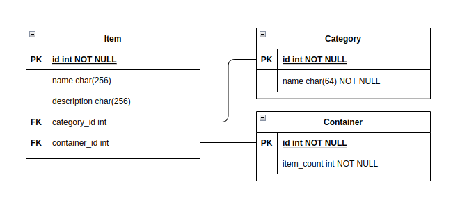
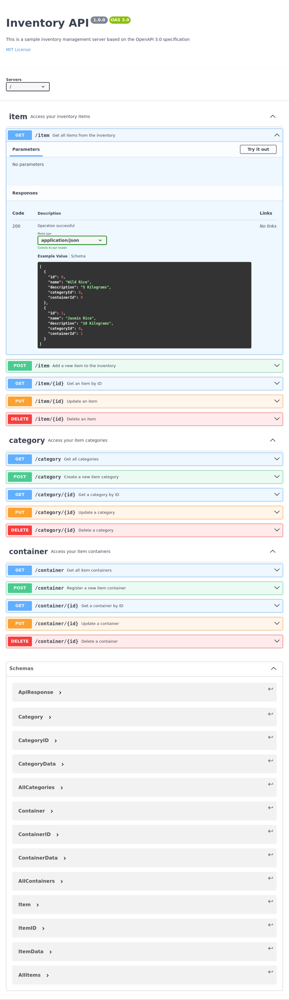

# Inventory API Server

A practice REST API for interacting with an inventory tracking DBMS.

# Getting Started

1. `docker build -t inventory_api_server .`
2. `docker-compose up -d`
3. `go test ./test`

# TODO

- Check API input
    - Prepared statements
    - Sanitization
    - Escape chars
- Authentication
    - API keys / Bearer

# Tables

# Endpoints

